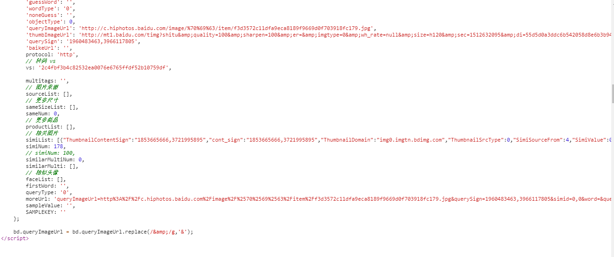
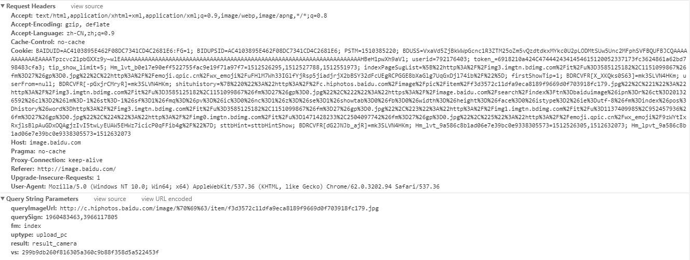
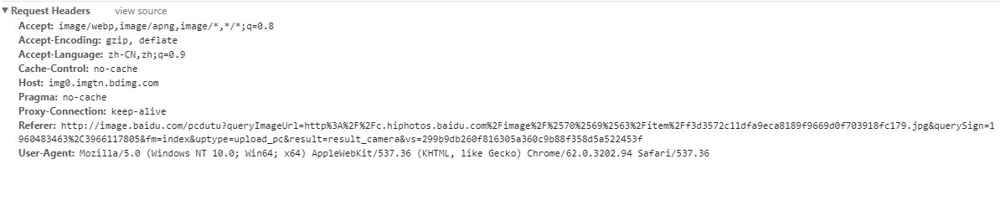

# 用itchat实现微信微信自动回复机器人(基于图灵api)

## 已经实现的功能

- ### 自动回复聊天内容

- 使用图灵api获取数据,回复聊天内容

  ```python
  def tuling_chat(msg):
      if not msg:
          return
      api_url = 'http://www.tuling123.com/openapi/api'
      data = {
          'key': '***************',
          'userid': 'wechat-robot'
      }
      data['info'] = msg
      try:
          r = requests.post(api_url, data=data).json()
          return r.get('text')
      except Exception as e:
          logging.error(e)
          return
      pass

  @itchat.msg_register(INCOME_MSG,  isFriendChat=True, isGroupChat=True)
  def tuling_reply(msg):
      reply = tuling_chat(msg['Text'])
      return reply or '哈哈哈哈'
      pass
  ```

- ### 根据收到的表情自动回复相应的表情

- 获取表情的真实URL

  ```python
  @itchat.msg_register(INCOME_MSG,  isFriendChat=True, isGroupChat=True)
  def tuling_reply(msg):
      msgType = msg.get('MsgType')
      content = msg.get('Content')
      if msgType == 47:
          cdnurl = re.findall(r'cdnurl = "(.*?)"', content, re.S)
          # TO-DO download simi image
          return
      pass
  ```

- 使用[百度搜图](http://image.baidu.com/)获取相关图片

- 拼接百度搜图URL

  ```python
   url = 'http://image.baidu.com/pcdutu?'
   data = {
       'queryImageUrl': queryImageUrl,
       'fm': 'index',
       'uptype': 'paste',
       'vs': '3deef828447f5ff536c613485d05ceafa7015901'
   }
   for key, value in data.items():
       url += '%s=%s&' % (key, value)
  ```

- 获取相关的图片信息

  

  

  ```python
    def _base_headers():
        lines = base_requests_headers.split('\n')
        lines = [item for item in lines if item.strip()]
        for line in lines:
            items = line.split(':', 1)
            if items[0] == 'Cookie':
                for cookie_line in items[1].split(';', 1):
                    cookie_items = cookie_line.split('=', 1)
                    cookies[cookie_items[0]] = cookie_items[1]
            else:
                headers[items[0]] = items[1]
        requests.utils.add_dict_to_cookiejar(session.cookies, cookies)
        pass
  ```

  获取相关图片的URL

  ```python
    result = session.get(url, headers=headers)

    data_result = re.findall(r'<script>(.*?)</script>', result.text, re.S)
    data_result = [item.strip()
                   for item in data_result if 'window.bd' in item]
    data_result = data_result[0] if data_result and len(
        data_result) > 0 else ''
    for line in data_result.strip().split('\n'):
        if 'simiList' in line:
            similist = json.loads(line[0:-1].replace('simiList: ', ''))
            break
    if similist:
        simiItem = similist[random.randint(0, len(similist))]['ThumbnailURL']
  ```

  相关图片的URL示例`http://img0.imgtn.bdimg.com/it/u=138971245,4080407985&fm=27&gp=0.jpg`直接在浏览器访问或者是程序请求会出现第一次正常,后面就会403,需要添加特殊请求头部

  

  ```python
    def _image_headers():
        lines = image_requests_headers.split('\n')
        lines = [item for item in lines if item.strip()]
        for line in lines:
            items = line.split(':', 1)
            image_headers[items[0]] = items[1]
        pass
  ```

- 将获取到的图片回复给用户

## 遇到的问题

- 在Win上执行正常`自动斗图部分图片获取不到相关图片或者请求超时`
- 在Mac上出现SSL验证失败
- 在Linux执行后账号立马被封
